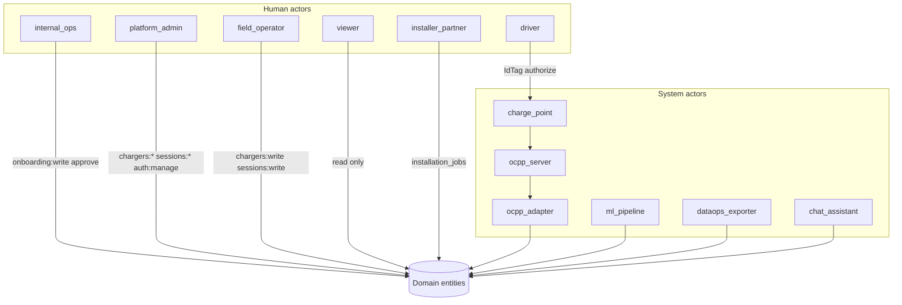
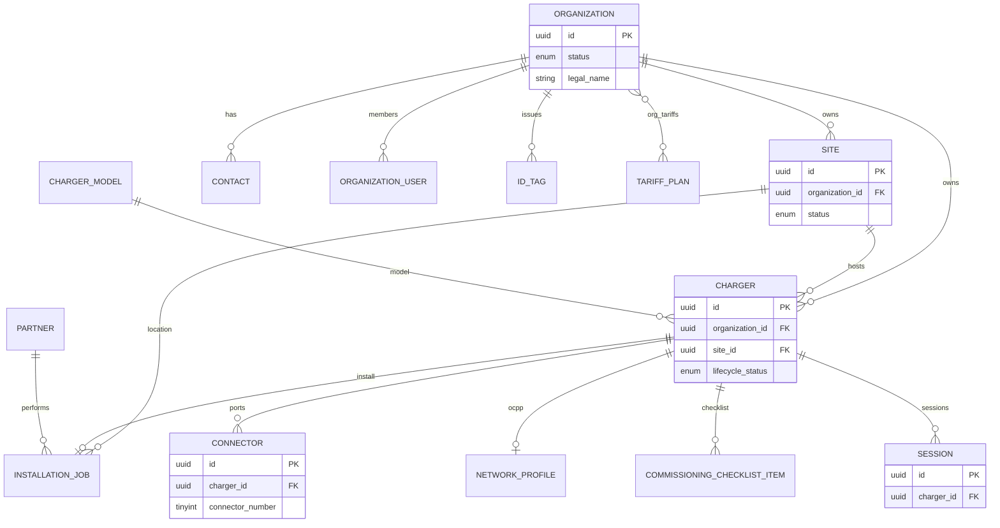

# Chargers — actors and entities

Actors are **people or systems** that perform actions. Entities are **persistent domain objects** with lifecycle and associations.

---

## 1. Actor catalog

| Actor ID | Name | Type | Primary application | Typical actions |
|----------|------|------|---------------------|-----------------|
| `internal_ops` | Internal onboarding operator | Human | Onboarding (VPN) | Create org/site/charger, approve, commission |
| `platform_admin` | Fleet platform administrator | Human | Operational + Auth | Full CRUD, user invites, `auth:manage` |
| `field_operator` | Field / NOC operator | Human | Operational | Start/stop sessions, manage chargers |
| `viewer` | Read-only stakeholder | Human | Operational | Monitor fleet and sessions |
| `driver` | End driver / EV owner | Human | Operational (future mobile) | Present IdTag, start session |
| `installer_partner` | Installation partner | Human / org | Onboarding | Complete install jobs |
| `charge_point` | Physical EVSE | Device | OCPP runtime | Connect, authorize, meter, fault |
| `ocpp_server` | OCPP CSMS stack | System | Platform | WebSocket, transactions |
| `ocpp_adapter` | ng-ocpp-adapter | System | Platform | Bridge OCPP ↔ RDS / sessions |
| `ml_pipeline` | ML train / predict services | System | Operational | Predict duration & energy |
| `dataops_exporter` | Lake export jobs | System | Batch | Session analytics to S3 |
| `chat_assistant` | AI assistant | System | Operational + Onboarding | Tools scoped by role |

---

## 2. Entity catalog

| Entity | Table (schema `chargers`) | Parent | Children / peers |
|--------|---------------------------|--------|------------------|
| **Organization** | `organizations` | — | sites, contacts, chargers, org_users, org_tariffs |
| **Site** | `sites` | organization | chargers, installation_jobs |
| **Contact** | `contacts` | organization | — |
| **Organization user** | `organization_users` | organization | links Cognito `user_sub` |
| **Charger model** | `charger_models` | — (catalog) | chargers (FK) |
| **Charger** | `chargers` | organization, site | connectors, network_profile, install_job, checklist, sessions |
| **Connector** | `connectors` | charger | — |
| **Installation job** | `installation_jobs` | charger, org, site | partner (optional) |
| **Partner** | `partners` | — | installation_jobs |
| **Onboarding document** | `onboarding_documents` | org / site / charger / job | S3 object |
| **Network profile** | `network_profiles` | charger | OCPP metadata |
| **Commissioning checklist item** | `commissioning_checklist_items` | charger | — |
| **Tariff plan** | `tariff_plans` | — | organization_tariffs |
| **Organization tariff** | `organization_tariffs` | org + tariff_plan | — |
| **IdTag** | `id_tags` | organization | driver token |
| **Session** | `sessions` | charger (via ops) | meter values, predictions |
| **Onboarding event** | `onboarding_events` | any onboarded entity | audit only |

**Platform entities (outside `chargers` schema):** OCPP charge point state (DynamoDB), live session (`charger_sessions`), faults (`fault_db_v2`).

---

## 3. Association model (cardinality)

---

## 4. Actor ↔ entity permissions

| Entity | internal_ops | platform_admin | field_operator | viewer | driver |
|--------|:------------:|:--------------:|:--------------:|:------:|:------:|
| Organization | CRUD + approve | read (scoped) | read | — | — |
| Site | CRUD | read | read | read | — |
| Charger (pre-commission) | CRUD + commission | — | — | — | — |
| Charger (commissioned+) | read | CRUD | CRUD | read | use |
| Connector | CRUD | read/write | read/write | read | — |
| Installation job | CRUD | — | read | — | — |
| Session | — | CRUD | CRUD | read | own |
| IdTag | CRUD (Ph 3) | assign | read | — | self |
| Tariff | CRUD (Ph 3) | read | read | — | — |
| Onboarding event | read | read (audit) | — | — | — |

Cognito permission strings: `onboarding:*`, `chargers:read|write`, `sessions:read|write`, `auth:manage`. See [roles.md](roles.md).

---

## 5. Cross-application visibility

| Entity state | Visible in onboarding UI | Visible in public operational UI |
|--------------|--------------------------|----------------------------------|
| Org `draft`…`approved` | ✓ | ✗ |
| Org `active` | ✓ | ✓ (scoped) |
| Charger `< commissioned` | ✓ | ✗ |
| Charger `commissioned`+ | ✓ | ✓ |
| Session (any) | ✗ | ✓ (if charger commissioned) |

**Commission event** is the handoff boundary between applications.

---

## 6. Audit association

Every onboarding entity links to **`onboarding_events`**:

| Field | Purpose |
|-------|---------|
| `entity_type` | organization, site, charger, contact, … |
| `entity_id` | UUID |
| `step` | submitted, approved, commissioned, … |
| `actor_sub` | Cognito subject of human actor |
| `payload` | JSON diff / notes |

See [lifecycles.md](lifecycles.md) for allowed transitions per entity.
