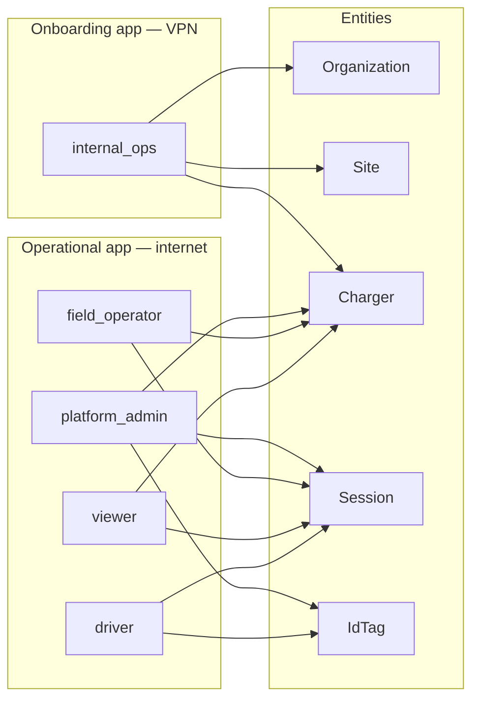
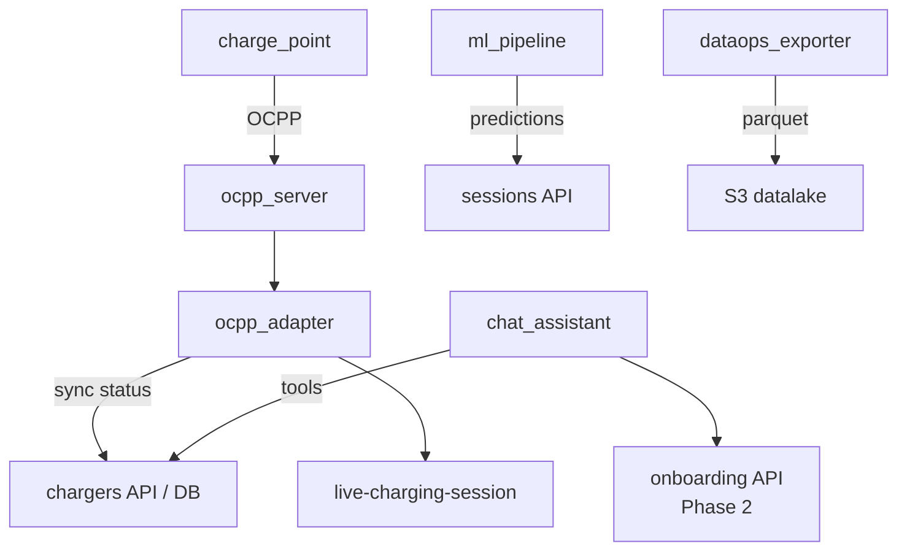

# Actor map — who touches what

Maps **human and system actors** to applications, entities, and lifecycle transitions.

## Human actors by application

## Actor responsibility matrix

| Actor | Organization | Site | Charger onboard | Charger ops | Session | IdTag | Install job |
|-------|:------------:|:----:|:---------------:|:-----------:|:-------:|:-----:|:-----------:|
| **internal_ops** | CRUD, approve | CRUD | CRUD, commission | read | — | CRUD Ph3 | CRUD |
| **platform_admin** | read | read | read | CRUD | CRUD | assign | read |
| **field_operator** | — | read | read | CRUD | CRUD | read | — |
| **viewer** | — | read | read | read | read | — | — |
| **driver** | — | — | — | use CP | start/stop | present | — |
| **installer_partner** | — | — | — | — | — | — | update job |

## System actors

| System actor | Triggers | Entities affected |
|--------------|----------|-------------------|
| **charge_point** | Plug-in, meter | Connector status, session |
| **ocpp_server** | WebSocket events | DynamoDB CP state |
| **ocpp_adapter** | Bridge jobs | `lifecycle_status`, sessions |
| **ml_pipeline** | Post-session / batch | Prediction fields on session |
| **dataops_exporter** | Scheduled | Lake tables |
| **chat_assistant** | User prompt | Read-only tools per RBAC |

## Cognito group → actor mapping

| Cognito group | Maps to actor | Application |
|---------------|---------------|-------------|
| `chargers-admin` + onboarding perms | internal_ops + platform_admin | Both |
| `chargers-operator` | field_operator | Operational |
| `chargers-viewer` | viewer | Operational |
| `manchana-family` | org grouping only | Pair with chargers-* role |
| `organization_users.role` | org_admin / org_operator / org_viewer | Tenant scope (Ph 4) |

See [roles.md](../roles.md) | [assignments.md](../assignments.md)
