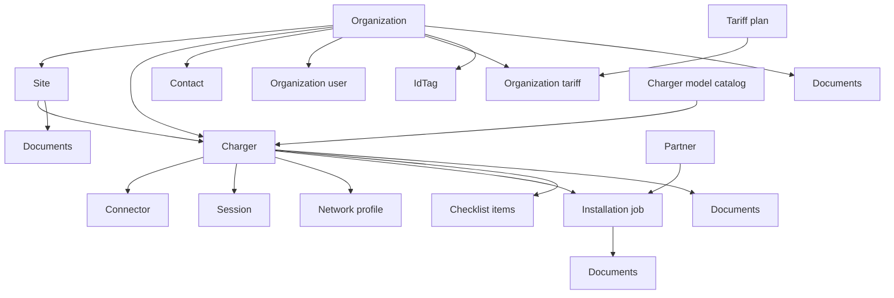
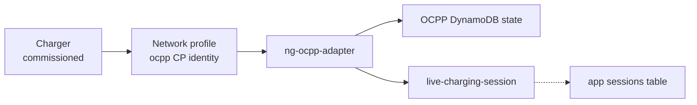

# Entity associations — Chargers domain

Full composition and foreign-key graph for ChargePoint-class onboarding + operational sessions.

## Hierarchy (contains)

## Association table

| From | To | Cardinality | FK / link |
|------|-----|-------------|-----------|
| Organization | Site | 1:N | `sites.organization_id` |
| Organization | Contact | 1:N | `contacts.organization_id` |
| Organization | Organization user | 1:N | `organization_users.organization_id` |
| Organization | Charger | 1:N | `chargers.organization_id` |
| Organization | IdTag | 1:N | `id_tags.organization_id` |
| Organization | Tariff plan | N:M | `organization_tariffs` |
| Site | Charger | 1:N | `chargers.site_id` |
| Site | Installation job | 1:N | `installation_jobs.site_id` |
| Charger model | Charger | 1:N | `chargers.charger_model_id` |
| Charger | Connector | 1:N | `connectors.charger_id` |
| Charger | Network profile | 1:1 | `network_profiles.charger_id` |
| Charger | Installation job | 1:1 typical | `installation_jobs.charger_id` |
| Charger | Checklist item | 1:N | `commissioning_checklist_items.charger_id` |
| Charger | Session | 1:N | `sessions` via charger id |
| Partner | Installation job | 1:N | `installation_jobs.partner_id` |
| Any onboard entity | Onboarding event | 1:N | `onboarding_events.entity_*` |
| Org/Site/Charger/Job | Document | 1:N | polymorphic `entity_type` + `entity_id` |

## Platform extension (outside `chargers` schema)

## Document polymorphism

| `entity_type` | Example `doc_type` |
|---------------|-------------------|
| `organization` | contract, W9 |
| `site` | permit, site_photo |
| `charger` | nameplate_photo, as_built |
| `installation_job` | sign_off, installer_report |

Storage: `s3://deviceniq-datalake/chargers/onboarding/documents/` (or app bucket).

See [actors-and-entities.md](../actors-and-entities.md) | [lifecycles.md](../lifecycles.md)
