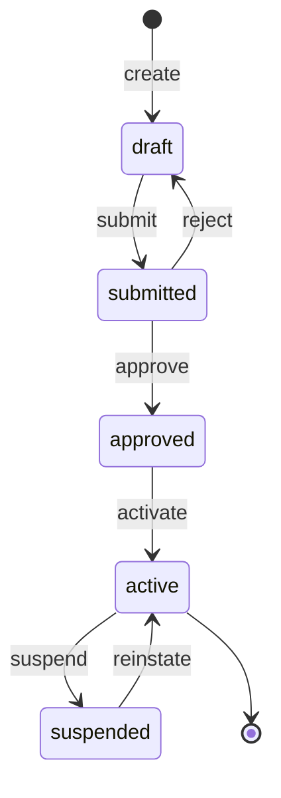
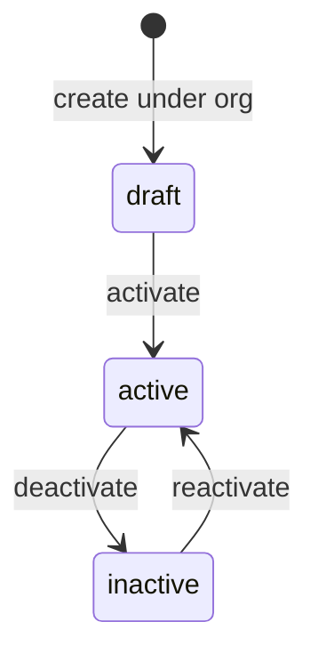
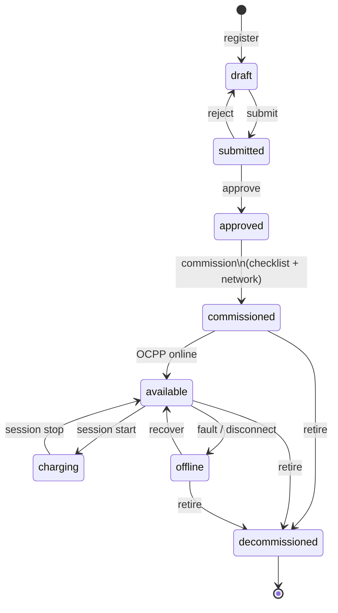
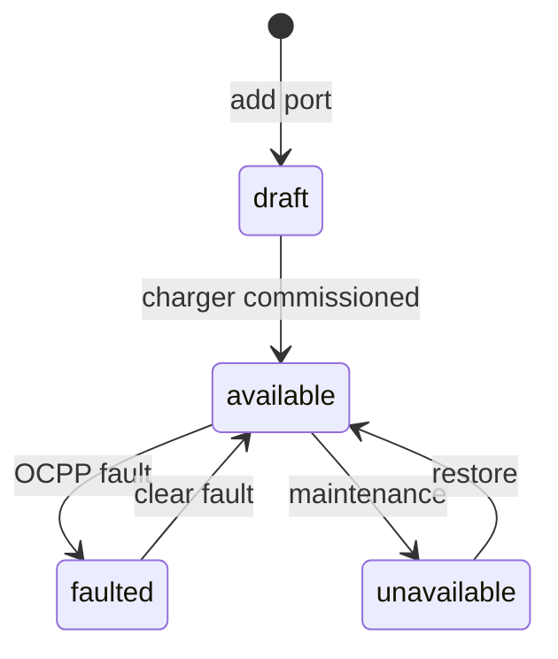
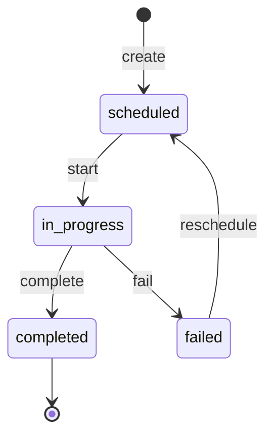
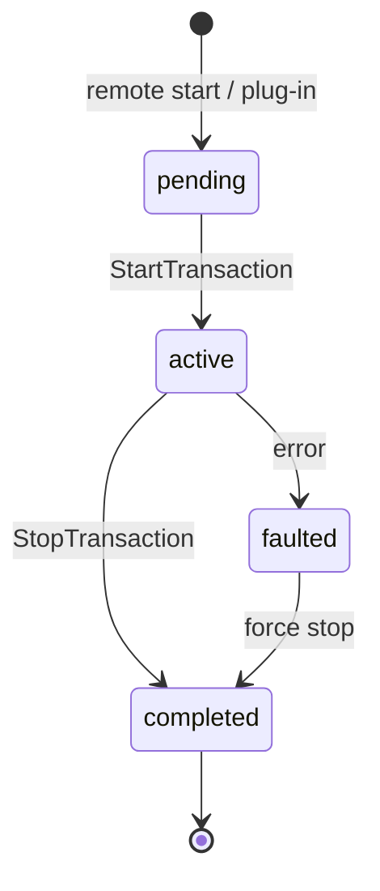
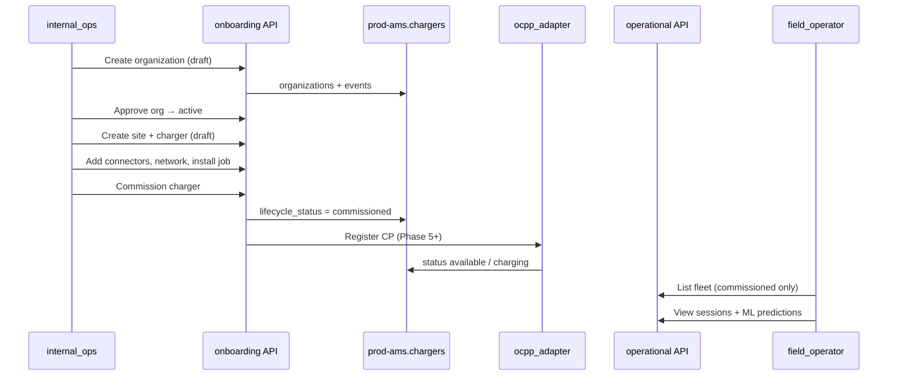

# Chargers — entity lifecycles

Each entity has a **lifecycle status** (and optional workflow fields). Transitions emit **`onboarding_events`** for onboarding entities. Operational states for chargers are driven by **OCPP** after commission.

---

## 1. Organization lifecycle

**Actor:** `internal_ops` (create/approve), `platform_admin` (suspend)

| Status | Public app | ChargePoint equivalent |
|--------|------------|------------------------|
| `draft` | Hidden | Prospect / staging account |
| `submitted` | Hidden | Pending approval |
| `approved` | Hidden | Approved, not billing-active |
| `active` | Tenant visible | Active account |
| `suspended` | Hidden | Suspended account |

**Associations active when `active`:** sites, commissioned chargers, org users, tariffs.

---

## 2. Site lifecycle

**Actor:** `internal_ops`

Sites must belong to an **`active`** (or approving) organization. Chargers reference `site_id`.

---

## 3. Charger lifecycle (onboarding + operations)

**Actors:** `internal_ops` (through `commissioned`), `ocpp_server` / `ocpp_adapter` (runtime states)

| Status | Actor | Public UI | OCPP |
|--------|-------|-----------|------|
| `draft` … `approved` | internal_ops | ✗ | Not registered |
| **`commissioned`** | internal_ops | **✓ appears** | Register CP (Ph 5–7) |
| `available` | System | ✓ | Connected, idle |
| `charging` | System | ✓ | Transaction active |
| `offline` | System | ✓ | Unreachable / fault |
| `decommissioned` | internal_ops | ✗ | Removed |

**Commission prerequisites (target):** org `active`, site `active`, checklist complete, `network_profiles` set, optional install job `completed`.

---

## 4. Connector lifecycle

**Actor:** `internal_ops` (onboarding), `charge_point` (runtime)

Each **connector** maps to OCPP `connectorId` via `ocpp_connector_id`.

---

## 5. Installation job lifecycle

**Actors:** `internal_ops`, `installer_partner`

Linked: `charger_id`, `organization_id`, `site_id`, optional `partner_id`.

---

## 6. Contact, document, network profile

| Entity | Lifecycle | Notes |
|--------|-----------|-------|
| **Contact** | Created → updated (no enum) | Typed: primary, billing, operations, legal |
| **Onboarding document** | Upload → immutable | S3 URI; tied to org/site/charger/job |
| **Network profile** | Draft at create → bound at commission | Drives OCPP CP identity |
| **Commissioning checklist item** | `completed` 0/1 per item | All required → commission allowed |
| **Charger model** | Catalog (no workflow) | Seed + admin CRUD |
| **Partner** | Active registry | Installer companies |
| **Tariff plan** | `draft` → `active` → `retired` | Assigned via `organization_tariffs` |
| **IdTag** | Issued → revoked | Phase 3; OCPP Authorize |

---

## 7. Session lifecycle (operational)

**Actors:** `field_operator`, `driver`, `charge_point`

Post-session: **session-predict** and **energy-predict** attach ML outputs; **dataops_exporter** lands rows in lake.

---

## 8. End-to-end journey (actors + entities)

---

## 9. Lifecycle vs ChargePoint station states

| DeviceNIQ `lifecycle_status` | ChargePoint station state (approx.) |
|-------------------------------|-------------------------------------|
| draft … approved | Unpublished / pending |
| commissioned | Activated, not yet online |
| available | Available / reachable |
| charging | In use |
| offline | Unreachable / fault |
| decommissioned | Deactivated / removed |

DeviceNIQ splits **business commission** from **telemetry-driven** states — clearer audit than a single “active” flag.
