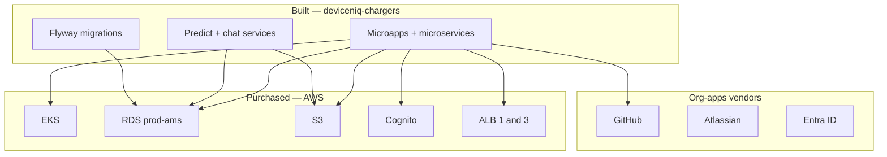

# Chargers — platform services and purchased vendors

DeviceNIQ Chargers is **built by DeviceNIQ** on **purchased / operated platform services**. This doc maps org-apps vendors to the chargers product.

## Build vs buy

| Layer | Built by DeviceNIQ | Purchased / platform |
|-------|-------------------|----------------------|
| Onboarding UI/API | ✓ `deviceniq-chargers` | — |
| Operational UI/API/ML | ✓ `deviceniq-chargers` | — |
| OCPP CSMS runtime | Integrate only | ✓ Existing Prod2-OCPP stack |
| Identity | Cognito config in app | ✓ **AWS Cognito** |
| Compute | K8s manifests | ✓ **AWS EKS** |
| Database | Flyway schema | ✓ **AWS RDS** `prod-ams` |
| Object storage | App + lake paths | ✓ **AWS S3** |
| DNS / TLS | Terraform in app repo | ✓ **Route53**, **ACM** |
| Load balancing | Ingress | ✓ **AWS ALB** (1 + 3) |
| ML tracking | MLflow jobs | ✓ **MLflow** on platform |
| Auth (engineering) | — | ✓ **Entra** (DeviceNIQ tenant) |
| Source control | — | ✓ **GitHub** DeviceNIQ org |
| Design | — | ✓ **Figma** / **Lucid** |
| Issue tracking | — | ✓ **Atlassian** Jira |

## AWS accounts (chargers runtime)

| Account role | MCP profile | Use for chargers |
|--------------|-------------|----------------|
| Production | `production-admin` | EKS, RDS, ALB 3, public app |
| Same VPC | — | ALB 1 onboarding (VPN) |
| Root / mgmt | `aws-management` | Org-level DNS if needed |

See [apps/aws/README.md](../aws/README.md).

## RDS

| Field | Value |
|-------|-------|
| Instance | `prod-ams` |
| Schema | **`chargers`** (one schema per app) |
| Migrations | Flyway in `deviceniq-chargers/002-data/000-database/` |

## Entra / My Apps

| Item | Value |
|------|-------|
| Tenant | `bdf0104c-0abf-45b1-bfb3-ca27784a1b34` |
| Engineering SSO | AWS IAM IC, GitHub, Atlassian, Azure |
| Chargers end-users | **AWS Cognito** (not Entra) — separate user pool |

## Domains (GoDaddy / Route53)

| Zone | Hostnames |
|------|-----------|
| `deviceniq.com` | `chargers.deviceniq.com`, `*.app.chargers.deviceniq.com`, `*.api.chargers.deviceniq.com` |

See [apps/godaddy/README.md](../godaddy/README.md).

## Related platform microservices (existing)

| Service | Schema | Role |
|---------|--------|------|
| `ng-ocpp-adapter` | `ocpp_txn` | OCPP bridge |
| `live-charging-session` | `charger_sessions` | Live sessions |
| `charger-management-service` | `fault_db_v2` | Faults |
| `charger-fault-processor` | `fault_db_v2` | Fault pipeline |

Inventory: [007-pending-aws-resources](https://github.com/DeviceNIQ/deviceniq-cursor-workspace/blob/main/implementationPlans/007-pending-aws-resources.md).

## Cursor MCP for product planning

| MCP | Purpose |
|-----|---------|
| `chargers-product` | URLs, roles, personas, test login |
| `aws-production` | Infra inspection |
| `github` | Issues, PRs, Actions |
| `ocpp` / `ocpp-simulator` | Protocol testing |

Setup: [org-apps-mcp.md](https://github.com/DeviceNIQ/deviceniq-cursor-workspace/blob/main/docs/org-apps-mcp.md)
