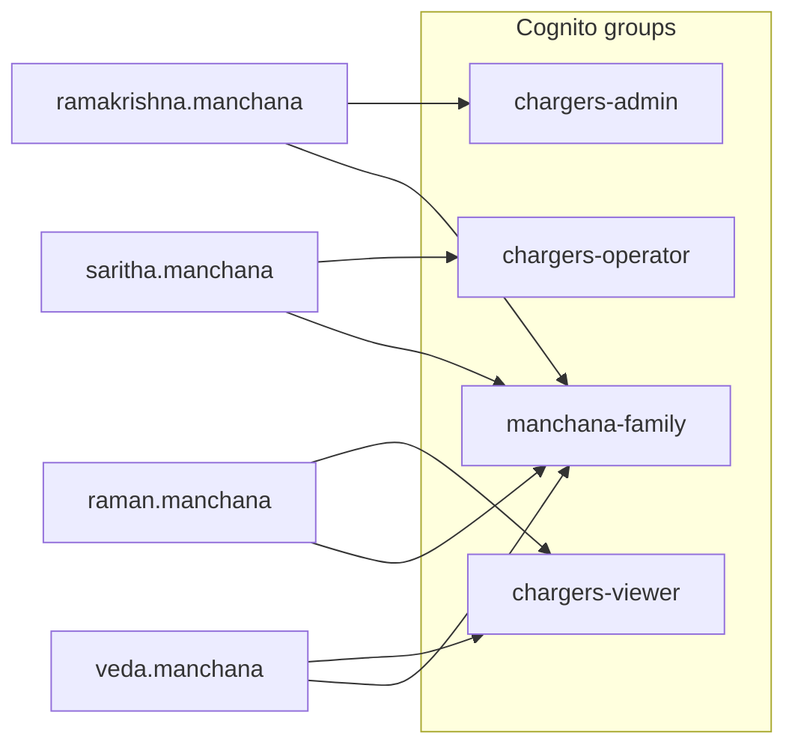

# Chargers — role assignments

Master matrix: **user → Cognito groups → permissions → org role → applications**.

Last updated from bootstrap Terraform + plan 013 target state. **No passwords in this repo.**

---

## 1. Cognito user assignments (production bootstrap)

| User | Email | Cognito groups | Effective permissions | Org role (target) | Onboarding | Operational |
|------|-------|----------------|----------------------|-------------------|:----------:|:-----------:|
| RamaKrishna Manchana | `ramakrishna.manchana@deviceniq.com` | `chargers-admin`, `manchana-family` | All + `auth:manage` | `org_admin` | ✓ (admin) | ✓ |
| Saritha Manchana | `saritha.manchana@deviceniq.com` | `chargers-operator`, `manchana-family` | chargers/sessions R/W | `org_operator` | | ✓ |
| Raman Manchana | `raman.manchana@deviceniq.com` | `chargers-viewer`, `manchana-family` | chargers/sessions R | `org_viewer` | | ✓ |
| Veda Manchana | `veda.manchana@deviceniq.com` | `chargers-viewer`, `manchana-family` | chargers/sessions R | `org_viewer` | | ✓ |



---

## 2. Group → permission assignment

| Cognito group | Assigned permissions |
|---------------|---------------------|
| `chargers-admin` | `chargers:read`, `chargers:write`, `sessions:read`, `sessions:write`, `auth:manage` |
| `chargers-operator` | `chargers:read`, `chargers:write`, `sessions:read`, `sessions:write` |
| `chargers-viewer` | `chargers:read`, `sessions:read` |
| `manchana-family` | *(none — organizational)* |

Onboarding (when enabled): `chargers-admin` also receives `onboarding:read`, `onboarding:write`, `onboarding:approve`, `organizations:read`, `organizations:write`.

---

## 3. User → actor → entity access

| User | Actor | Organization | Site | Charger (ops) | Session | Invite users |
|------|-------|:------------:|:----:|:-------------:|:-------:|:------------:|
| RamaKrishna | platform_admin / internal_ops | CRUD | CRUD | CRUD | CRUD | ✓ |
| Saritha | field_operator | R | R | CRUD | CRUD | |
| Raman | viewer | R | R | R | R | |
| Veda | viewer | R | R | R | R | |

---

## 4. Engineering assignments (Entra / platform — not Cognito)

| User | Entra UPN | AWS IAM IC | GitHub DeviceNIQ | Atlassian | Chargers app login |
|------|-----------|------------|------------------|-----------|-------------------|
| RamaKrishna Manchana | `manchana.ramakrishna@deviceniq.com` | ✓ app role | Owner | Admin | Separate Cognito user (`ramakrishna.manchana@…`) |

Cross-reference: [aws/assignments.md](../../apps/aws/assignments.md), [github/assignments.md](../../apps/github/assignments.md), [atlassian/assignments.md](../../apps/atlassian/assignments.md).

---

## 5. Future B2B assignments (template)

When customer orgs onboard (plan 013 Ph 4):

| User (example) | organization_id | Cognito groups | org_users.role |
|----------------|-----------------|----------------|----------------|
| `ops@customer.com` | `{org_uuid}` | `chargers-operator` | `org_operator` |
| `exec@customer.com` | `{org_uuid}` | `chargers-viewer` | `org_viewer` |
| `admin@customer.com` | `{org_uuid}` | `chargers-admin` | `org_admin` |

Invite path: onboarding API → Cognito `AdminCreateUser` → `organization_users` insert → group assignment.

---

## 6. Local test credentials (not in git)

| File | Purpose |
|------|---------|
| `%USERPROFILE%\.cursor\chargers-product-test-users.json` | MCP `login_persona` passwords |
| `scripts/chargers-product-test-users.example.json` | Template in cursor-workspace |

---

## 7. Verify assignments

```powershell
# Cursor MCP (no password in output)
# Agent: "Use chargers-product MCP list_test_personas and login_persona admin"
```

```powershell
# Live /auth/me (local credentials file required)
powershell -File scripts\setup-chargers-product-mcp.ps1
```

---

## 8. My Apps (Entra catalog)

| Item | Value |
|------|-------|
| Enterprise app (target) | DeviceNIQ Chargers |
| Homepage URL | `https://github.com/DeviceNIQ/deviceniq-org-apps/blob/main/products/chargers/README.md` |
| Collection | DeviceNIQ — Products |

End-user auth remains **Cognito**; Entra tile is documentation + engineering SSO hub.

See [users.md](users.md) | [roles.md](roles.md)
