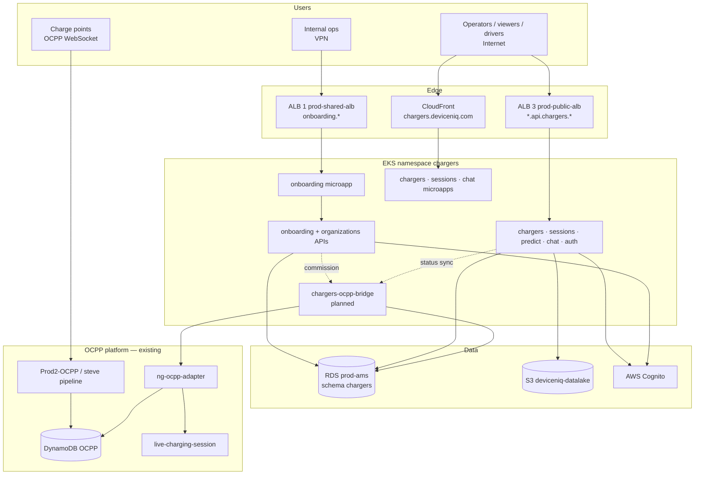

# System landscape — Chargers product

Three runtime bands: **onboarding (VPN)**, **operational (internet)**, **OCPP platform (existing)**.

## Deployment matrix

| Component | Hostname pattern | ALB | Auth |
|-----------|------------------|-----|------|
| Onboarding UI | `onboarding.chargers.deviceniq.com` | 1 | Cognito + VPN |
| Onboarding API | `onboarding.api.chargers.deviceniq.com` | 1 | JWT + onboarding perms |
| Public UI | `chargers.deviceniq.com`, `*.app.chargers.*` | CF + 3 | Cognito |
| Public API | `*.api.chargers.deviceniq.com` | 3 | Cognito JWT |

## Repo

Single monorepo **`deviceniq-chargers`** — path-filtered CI deploys changed modules only.

See [product-information.md](../product-information.md) | [platform-and-vendors.md](../platform-and-vendors.md)
