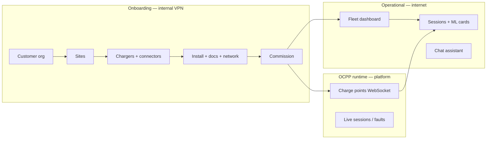

# Chargers — product information

**Product:** DeviceNIQ Chargers  
**Market:** Fleet operators, workplace/home multi-user charging, platform owners  
**Benchmark:** [ChargePoint](https://www.chargepoint.com/) fleet / station management (account → site → station → connector → driver)

---

## 1. Product vision

DeviceNIQ Chargers is a **full-stack EV charging product**: internal **onboarding & commissioning** (ChargePoint-class admin) plus a **public operational app** with **ML predictions**, **session analytics**, and **AI assistant** — areas where legacy CSMS UIs are typically weak.

---

## 2. Capability matrix vs ChargePoint

| Capability | ChargePoint (typical CSMS) | DeviceNIQ — onboarding | DeviceNIQ — operational | Differentiator |
|------------|----------------------------|------------------------|-------------------------|----------------|
| Customer / account | ✓ | ✓ Planned (org) | Org-scoped fleet (Ph 2) | Shared schema, audit trail |
| Sites / locations | ✓ | ✓ Planned | Map + timezone | Same |
| Station hardware registry | ✓ | ✓ Model catalog, serial, connectors | Fleet list | Connector-level detail |
| Installation workflow | ✓ | ✓ Jobs, partners, checklist | — | Commission gate |
| Documents (permits, photos) | ✓ | ✓ S3-backed | — | Data lake path |
| OCPP / network profile | ✓ Built-in | ✓ Metadata → **existing OCPP stack** | Live status (partial) | Reuse Prod2-OCPP, no rebuild |
| Driver / RFID (IdTag) | ✓ | ✓ Phase 3 | Future ops | OCPP authorize bridge |
| Tariffs / pricing | ✓ | ✓ Phase 3 | Future billing | — |
| Live sessions | ✓ | — | ✓ Shipped | — |
| Session history | ✓ | — | ✓ Shipped | — |
| **Session duration prediction** | Limited / add-on | — | ✓ **ML + baseline** | **Strong** |
| **Energy delivered prediction** | Limited | — | ✓ **ML + MLflow** | **Strong** |
| **Data lake / analytics export** | Enterprise add-on | SLA analytics Ph 4 | ✓ DataOps pipeline | **Strong** |
| **Role-aware AI chat** | Rare | Onboarding tools Ph 2 | ✓ Shipped | **Strong** |
| Roaming / eMSP | ✓ | Future | Future | Roadmap |
| Payments | ✓ | Phase 5+ | Phase 5+ | Out of scope v1 |

**Positioning:** Match or exceed ChargePoint on **entity model and commissioning**; **beat** ChargePoint on **operational intelligence** (ML, lake, chat).

---

## 3. What we ship today vs building

Application split (onboarding vs operational microapps, URLs, roles): **[applications.md](applications.md)**.

### Shipped (operational application)

| Module | Type | Capability |
|--------|------|------------|
| `chargers` microapp | UI | Fleet list, charger detail |
| `sessions` microapp | UI | Session cards, history |
| `chat` / `support` microapps | UI | Assistant |
| `chargers` API | REST | CRUD fleet (demo / global) |
| `sessions` API | REST | Session history |
| `session-predict` / `energy-predict` | ML API | Duration & kWh predictions |
| `chat-assistant` | AI API | Role-aware Q&A |
| `auth` API | REST | Cognito JWT, `/auth/me` |
| DataOps export | Batch | Lake path ([plan 011](https://github.com/DeviceNIQ/deviceniq-cursor-workspace/blob/main/implementationPlans/011-chargers-session-duration-data-platform.md)) |

### Building (onboarding application — plan 013)

| Module | Phase | Capability |
|--------|-------|------------|
| `onboarding` microapp | MVP | Customer + charger queues, wizards |
| `onboarding` API | MVP | Submit, approve, commission, audit |
| `organizations` API | MVP | Org + site CRUD |
| Flyway V5–V15 | MVP–3 | Full ChargePoint-class schema |
| Org-scoped public fleet | Ph 2 | Only `commissioned`+ for tenant |
| OCPP bridge | Ph 5–7 | Commission → activate CP; status sync |

### Platform we integrate (do not rebuild)

| System | Role |
|--------|------|
| `Prod2-OCPP` / `steve_ocpp_pipeline` | OCPP WebSocket server |
| 18× DynamoDB OCPP tables | Transaction / CP state |
| `ng-ocpp-adapter` | OCPP ↔ platform |
| `live-charging-session` | Live session service |
| `charger-management-service` | Faults / ops |

---

## 4. Domain glossary (ChargePoint-aligned)

| DeviceNIQ term | ChargePoint / industry term | Notes |
|----------------|----------------------------|-------|
| **Organization** | Account / customer | B2B tenant |
| **Site** | Location / property | Geo, timezone |
| **Charger** | Station / EVSE | Serial, model, lifecycle |
| **Connector** | Port / plug | 1..N per charger |
| **Charger model** | Hardware SKU catalog | Manufacturer + model code |
| **Installation job** | Install work order | Partner, schedule |
| **Network profile** | OCPP connection profile | CP identity, URL |
| **IdTag** | RFID / driver token | Authorize at CP |
| **Tariff plan** | Pricing plan | Per-kWh, session fee |
| **Commission** | Activate / publish station | Gate to public app |
| **Session** | Charging session | Start/stop, meter values |

---

## 5. Non-functional requirements

| Area | Target |
|------|--------|
| **Security** | Cognito groups; org-scoped data; onboarding VPN-only |
| **Availability** | EKS multi-AZ; RDS `prod-ams` |
| **Observability** | Platform logging; onboarding audit (`onboarding_events`) |
| **Compliance** | Document retention S3; PII in contacts — minimize in logs |
| **Scale** | Path-filtered CI; HPA on predict services |

---

## 6. Roadmap phases (summary)

| Phase | Onboarding | Operational | OCPP |
|-------|------------|-------------|------|
| **1–2 MVP** | Org, site, charger, commission | Org-scoped fleet | No change |
| **3** | Contacts, models, connectors, install, docs | Same filter | Network profile stub |
| **4** | Cognito invites, SLA analytics, chat tools | Org users see fleet | — |
| **5** | Tariffs, IdTags | Driver tags | Authorize bridge |
| **7** | — | Live status in UI | Commission → OCPP activate |

Detail: [lifecycles.md](lifecycles.md), [014 landscape plan](https://github.com/DeviceNIQ/deviceniq-cursor-workspace/blob/main/implementationPlans/014-chargers-onboarding-to-operational-landscape.md).
