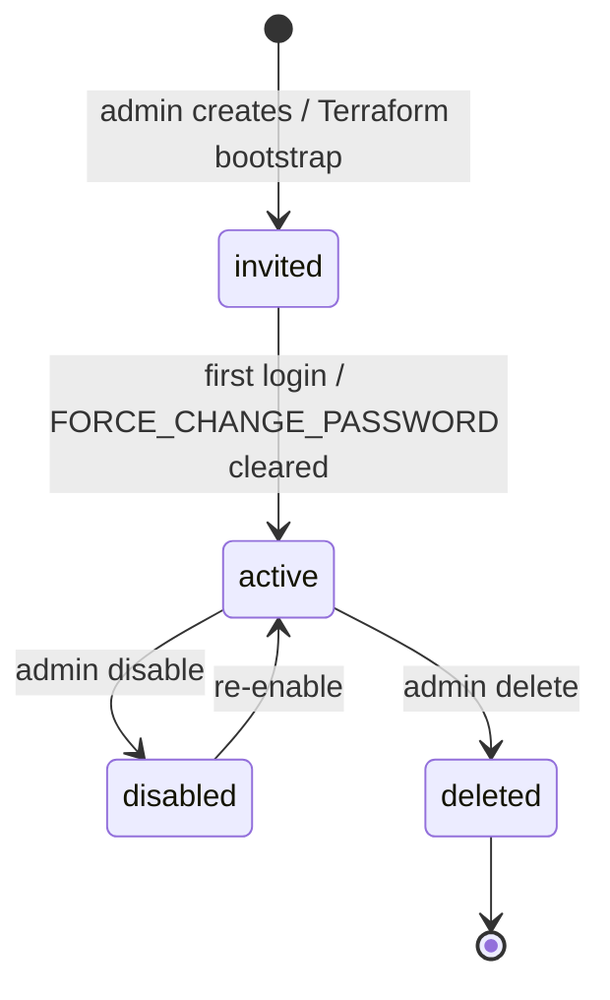

# Chargers — users

Identity provider: **AWS Cognito** (user pool in `deviceniq-chargers` Terraform).  
Engineering staff also have **Entra ID** accounts for AWS/GitHub — not for logging into the public chargers app.

**Never commit passwords.** Cognito bootstrap: `deviceniq-chargers/004-infrastructure/cognito/README.md`.

---

## 1. Production users (Cognito — bootstrap)

Manchana household / DeviceNIQ fleet bootstrap accounts (Terraform).

| Display name | Email (UPN) | Cognito groups | Effective permissions | Actor | Applications |
|--------------|-------------|----------------|----------------------|-------|--------------|
| RamaKrishna Manchana | `ramakrishna.manchana@deviceniq.com` | `chargers-admin`, `manchana-family` | All chargers + sessions + `auth:manage` | platform_admin, internal_ops* | Operational (+ onboarding when live) |
| Saritha Manchana | `saritha.manchana@deviceniq.com` | `chargers-operator`, `manchana-family` | chargers/sessions read+write | field_operator | Operational |
| Raman Manchana | `raman.manchana@deviceniq.com` | `chargers-viewer`, `manchana-family` | chargers/sessions read only | viewer | Operational |
| Veda Manchana | `veda.manchana@deviceniq.com` | `chargers-viewer`, `manchana-family` | chargers/sessions read only | viewer | Operational |

\* `internal_ops` when `onboarding:*` permissions and VPN access are granted (plan 013).

### Alternate emails (same person — other systems)

| Person | Chargers (Cognito) | Entra / mail | Notes |
|--------|-------------------|--------------|-------|
| RamaKrishna | `ramakrishna.manchana@deviceniq.com` | `manchana.ramakrishna@deviceniq.com` | Primary engineering UPN |
| Veda | `veda.manchana@deviceniq.com` | `manchana.veda@deviceniq.com` | Work mail alias |

---

## 2. User types (taxonomy)

| User type | IdP | Created by | Typical count |
|-----------|-----|------------|---------------|
| **Platform bootstrap user** | Cognito | Terraform / admin | Small (family + ops) |
| **Organization user** | Cognito | Admin invite (Ph 4) | Per B2B customer |
| **Driver** | Cognito or IdTag-only (Ph 3) | Org admin | Many per fleet |
| **Internal onboarding operator** | Cognito + VPN | DeviceNIQ IT | `chargers-admin` + onboarding perms |
| **Installer partner** | External | Partner portal (future) | Per install vendor |
| **Engineering (no app login)** | Entra | DeviceNIQ tenant | Deploy only |

---

## 3. Organization users (planned — Phase 4)

Table: `organization_users` — links Cognito `user_sub` to a customer **organization**.

| Field | Purpose |
|-------|---------|
| `organization_id` | Tenant (customer) |
| `user_sub` | Cognito subject UUID |
| `role` | `org_admin` \| `org_operator` \| `org_viewer` |

**Target assignments (example — default org after backfill):**

| user_sub (via email) | organization | org role |
|----------------------|--------------|----------|
| RamaKrishna (`ramakrishna.manchana@deviceniq.com`) | Default / Manchana fleet | `org_admin` |
| Saritha | Same org | `org_operator` |
| Raman, Veda | Same org | `org_viewer` |

Refresh after Flyway V5+ and invite flow ship.

---

## 4. Engineering users (Entra — not Cognito)

DeviceNIQ staff accessing **platform** to build/run chargers (not end-user app login).

| Display name | Entra UPN | Purpose | Related org-apps |
|--------------|-----------|---------|------------------|
| RamaKrishna Manchana | `manchana.ramakrishna@deviceniq.com` | Platform owner, deploy, admin | [aws](../../apps/aws/assignments.md), [github](../../apps/github/assignments.md), [azure](../../apps/azure/assignments.md) |
| *(team)* | `@deviceniq.com` | Engineering | Per onboarding |

---

## 5. Service / system identities

| Identity | Type | Used for |
|----------|------|----------|
| EKS IRSA roles | AWS IAM | Microservices → RDS, S3 |
| Cognito app client | OAuth client | SPA / mobile → auth API |
| GitHub Actions | OIDC / secrets | CI/CD `deviceniq-chargers` |
| OCPP charge point | Device cert / id | WebSocket to Prod2-OCPP |

No human password — document in [platform-and-vendors.md](platform-and-vendors.md).

---

## 6. User lifecycle (Cognito)

Org invite flow (Ph 4): admin → Cognito `AdminCreateUser` → email → `organization_users` row → group assignment.

---

## 7. Related docs

| Doc | Content |
|-----|---------|
| [roles.md](roles.md) | Role definitions and permissions |
| [assignments.md](assignments.md) | User → role assignment matrix |
| [actors-and-entities.md](actors-and-entities.md) | Actor model |

Verify live RBAC: `chargers-product` MCP → `login_persona` / `list_test_personas`.
